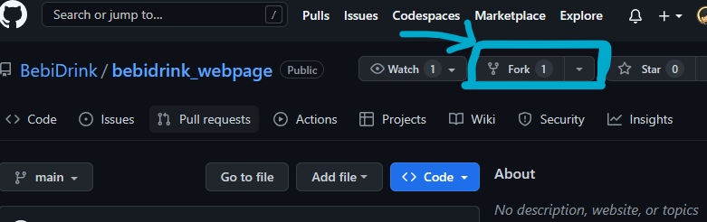
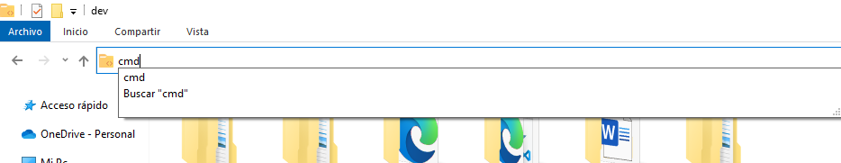

##  GUÍA DE GIT /GITHUB PARA COLABORADORES


Esta es la guía para trabajar con Git y GitHub para los integrantes de este equipo. 

---
# 1. Copiar el proyecto en tu cuenta
Antes que nada, empecemos por copiar el repositorio principal en tu cuenta de GitHub. Para ello utiliza la opción `fork` como se muestra en la siguiente imagen:




- Es importante dejar el nombre por defecto del repositorio principal:  `bebidrink_webpage`

Por último dale click a `create fork` y ¡listo!, ya has copiado el repositorio principal en tu cuenta.


---
Una vez hecho el `fork` podemos seguir con los siguientes pasos:

# 2. Clonar tu nuevo repositorio
Para clonar el repositorio, sigue estos pasos:

1. Elige una carpeta de trabajo y abre una consola con la ruta de esa carpeta. Tienes al menos dos métodos para esto: 
    1. ##### **Método 1:** _haz click derecho y selecciona abrir `terminal` o `Git bash here`_ 
    2. ##### **Método 2:** _En el buscador de tus archivos, dónde está la ruta de tu carpeta, escribe `cmd` y presiona `enter`_  
2. Una vez abierta la _consola_ ejecuta los siguientes comandos para clonar la copia del repositorio que previamente creaste en tu cuenta de GitHub:

```console
git clone https://github.com/TU-USUARIO/bebidrink_webpage.git
```


- En el comando anterior, cambia "TU-USUARIO" por el nombre de **usuario** que registraste en tu cuenta de github.

3. Se clonará el repositorio del fork en tu máquina.

# 3. Agregar/configurar el repositorio principal como upstream:

1. Navega al directorio del repositorio clonado: 
```console
cd bebidrink_webpage
```
2. Ejecuta el siguiente comando para agregar el repositorio principal como upstream: 
```console
git remote add upstream https://github.com/BebiDrink/bebidrink_webpage.git
```
3. Se agregará el repositorio principal como upstream en tu repositorio del fork.

# 4. Crear una nueva rama derivada de la rama principal "main":

1. Actualiza tu copia local con: 
```console
git fetch upstream
```
2. Crea una nueva rama llamada develop(recomendado): 
```console
git checkout -b develop upstream/main
```
3.  Actualiza el repo en tu cuenta de GitHub:
```console
git push origin
```
--- 

# Agregar, commitear y hacer push de los cambios
1.  Realiza los cambios necesarios en los archivos del repositorio.

2. Agrega los cambios al área de preparación: 
```console
git add -A
```

3. Realiza el commit de los cambios: 
```console
git commit -m "mensaje del commit"
```
Es recomendable que se describan los cambios hechos, por ejemplo _`git commit -m "agregando funcionalidad a los botones de los productos"`_

4. Haz push de los cambios a tu repositorio del fork:
```console
git push origin develop
```
Esto habilitará la opción de hacer pull & request de tus cambios.

#  ACTUALIZAR TU REPO LOCAL.

Es muy importante, que actualices periódicamente tu repositorio local, para que si algun miembro del equipo hizo cambios, se vean reflejados en tu copia local y se mantenga actualizado tu repositorio. 

Por ejemplo cada día, o cada vez que vuelvas a trabajar en el proyecto, para actualizar ejecuta (copia y pega) lo siguiente:


```console
# Actualizar la rama "main" y "develop" desde el repo principal
git checkout main
git fetch upstream
git merge upstream/main
git push origin main
git checkout develop
git pull origin main
```