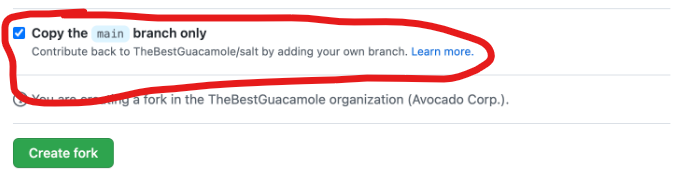

##  GUÍA DE GIT /GITHUB PARA COLABORADORES


Esta es la guía para trabajar con Git y GitHub para los integrantes de este equipo. 

---
### Copiar el proyecto en tu cuenta
Antes que nada, empecemos por copiar el repositorio principal en tu cuenta de GitHub. Para ello utiliza la opción `fork` como se muestra en la siguiente imagen:


Una vez seleccionada la opción, es recomendable dejar el nombre por defecto del repositorio. 

<br> Asegurate de **DESMARCAR** la opción _`"copy the main branch only"`_. Esto sirve para que tanto la rama `main` _( la principal)_ y la rama `develop` _(dónde se revisaran los cambios y el desarrollo del proyecto)_ se copien en tu nuevo repo.


---
> Una vez hecho el `fork` podemos seguir con los siguientes pasos:

# Clonar el repositorio
Para clonar el repositorio, sigue estos pasos:

1. Elige una carpeta de trabajo y abre una consola con la ruta de esa carpeta. Tienes al menos dos métodos para esto: 
    1. ##### Método 1: haz click derecho y selecciona abrir `terminal` o `Git bash here` 
    2. ##### Método 2: En el buscador de tus archivos, dónde está la ruta de tu carpeta, escribe `cmd` y presiona `enter`  
2. Una vez abierta la _consola_ ejecuta los siguientes comandos para clonar la copia del repositorio que previamente creaste en tu cuenta de GitHub:
```console
git clone https://github.com/TU-USUARIO/bebidrink_webpage.git
```
3. Se clonará el repositorio del fork en tu máquina.

# Agregar/configurar el repositorio principal como upstream:

1. Navega al directorio del repositorio clonado: 
```console
cd bebidrink_webpage
```
2. Ejecuta el siguiente comando para agregar el repositorio principal como upstream: 
```console
git remote add upstream https://github.com/BebiDrink/bebidrink_webpage.git
```
3. Se agregará el repositorio principal como upstream en tu repositorio del fork.

# Crear una nueva rama derivada de la rama "develop":

1. Asegúrate de estar en la rama "develop" del repositorio del fork: 
```console
git checkout develop
```
2. Crea una nueva rama derivada de "develop": 
```console
git checkout -b nueva-rama
```


####  Asegurate de cambiar "nueva-rama" por la primer letra de tu nombre y tu apellido.

Por ejemplo si ejecutas _`git checkout -b psanchez`_. Esto creará una nueva rama llamada **psanchez** que está derivada de la rama "develop".git